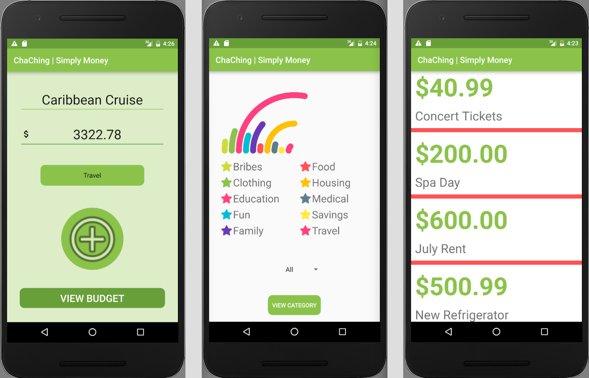

# _Cha-Ching: Simply Money_

#### _A simple Android app for entering and displaying purchases, sorted by category and visualized in graphs._

#### By _**Adam Craig and Ashley Maceli**_

## Description

_An Android app centered around keeping track of expenses. Users can add purchases and categorize them under several common expense types. Data is saved in Firebase and visualized with a colorful DecoView customized by category._

## Setup/Installation Requirements

* _Ensure that Android Studio is installed on your machine._
* _Using the command line, clone the repository to your desktop using the command "git clone https://github.com/AshleyRayMaceli/cha-ching-android"_
* _Open the package using Android Studio, choose your emulator, and run the app._

## Known Bugs

_No known bugs at this time._

## Support and contact details

_For all issues and support, please contact:
Adam Craig at ajcraig@suffolk.edu or Ashley Maceli at ashley.maceli@gmail.com_

## Technologies Used

_Java, Gradle, Android Framework, Android Studio, Google Firebase_

### License

The MIT License (MIT)

Copyright (c) 2016 Adam Craig and Ashley Maceli

Permission is hereby granted, free of charge, to any person obtaining a copy
of this software and associated documentation files (the "Software"), to deal
in the Software without restriction, including without limitation the rights
to use, copy, modify, merge, publish, distribute, sublicense, and/or sell
copies of the Software, and to permit persons to whom the Software is
furnished to do so, subject to the following conditions:

The above copyright notice and this permission notice shall be included in all
copies or substantial portions of the Software.

THE SOFTWARE IS PROVIDED "AS IS", WITHOUT WARRANTY OF ANY KIND, EXPRESS OR
IMPLIED, INCLUDING BUT NOT LIMITED TO THE WARRANTIES OF MERCHANTABILITY,
FITNESS FOR A PARTICULAR PURPOSE AND NONINFRINGEMENT. IN NO EVENT SHALL THE
AUTHORS OR COPYRIGHT HOLDERS BE LIABLE FOR ANY CLAIM, DAMAGES OR OTHER
LIABILITY, WHETHER IN AN ACTION OF CONTRACT, TORT OR OTHERWISE, ARISING FROM,
OUT OF OR IN CONNECTION WITH THE SOFTWARE OR THE USE OR OTHER DEALINGS IN THE
SOFTWARE.
